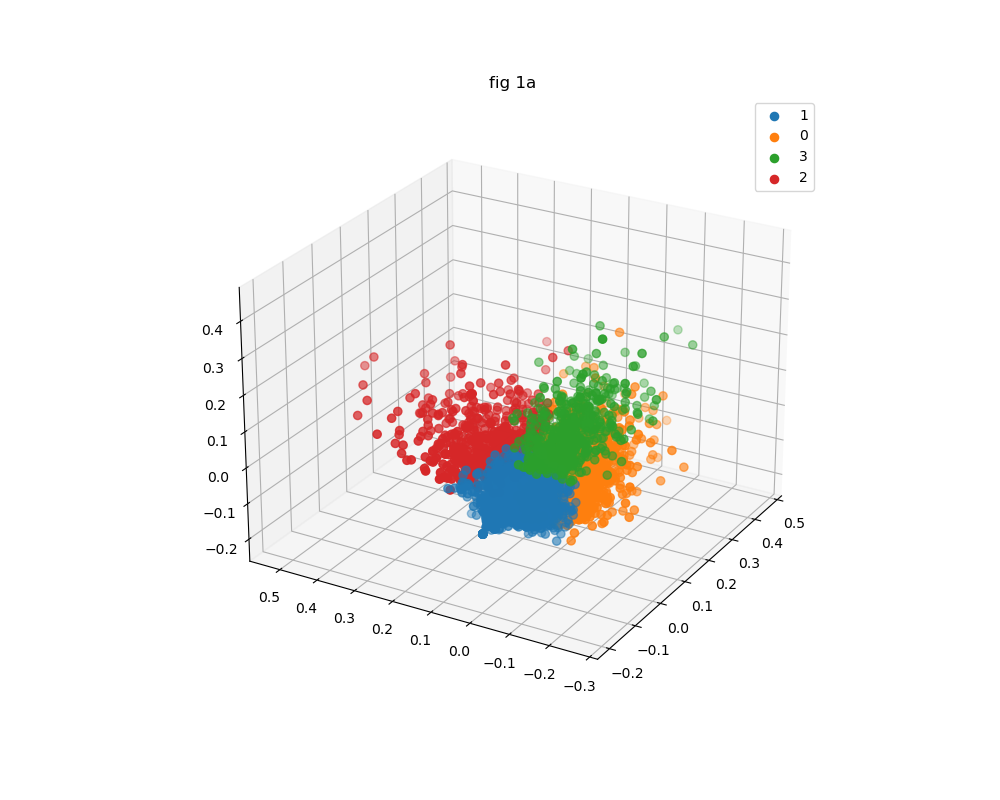
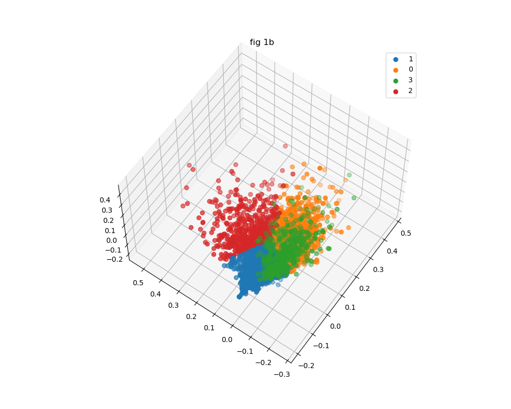
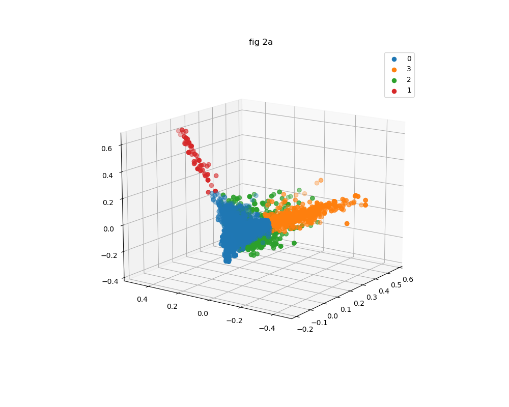
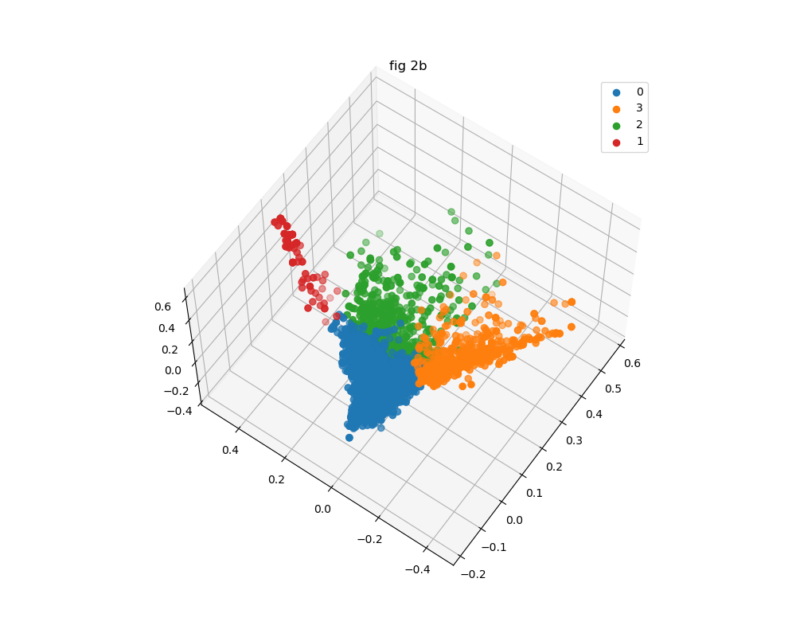
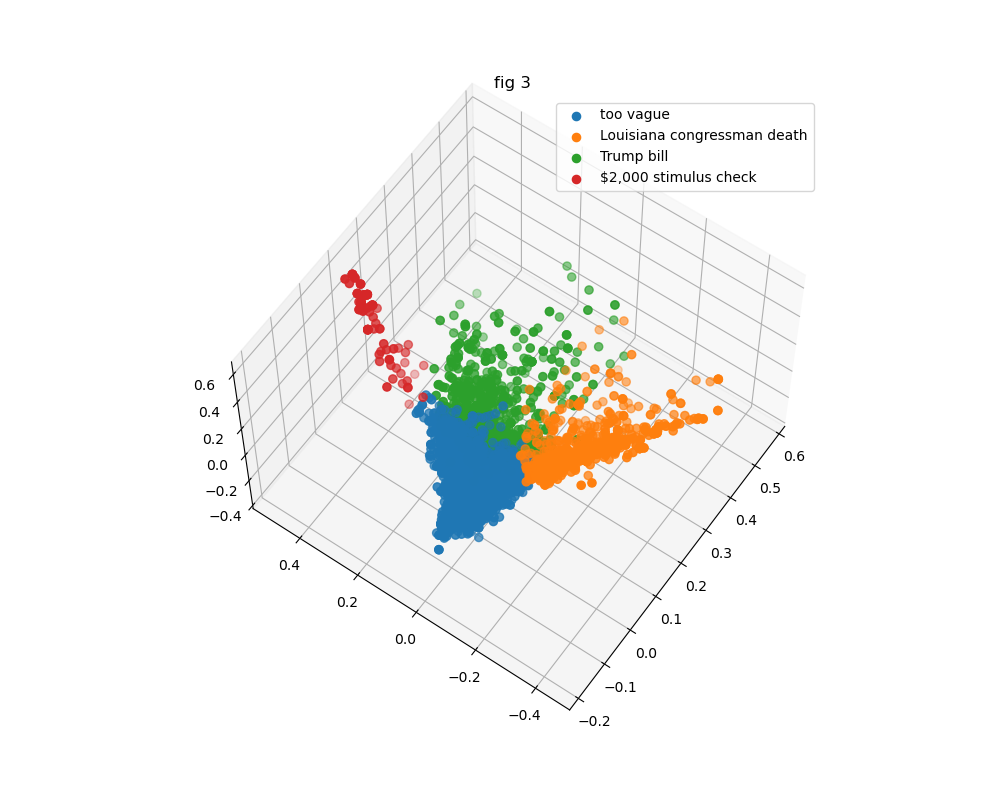

# Clustering Project

 by James Kidd, Thames Manisy, Pavel Borovikov

    In this project, we web-scraped comments and posts from Reddit's [r/politics](https://www.reddit.com/r/politics/) subreddit during 2020 using Pushshift API and used unsupervised machine learning to find relevant similarities between comments and post titles.

 

## Data

There are a total of 4578 comments and 9966 post titles. The comments and titles are clustered seperately. The clustering algorithm only used the text from the data, therefore does not include any other information such as date, score (reddit upvotes), post title in the case of comments, or any other feature provided by Pushshift API.

> **The data was not filtered of profanity. There may be offensive language in the data available.**

Some samples of the data are available in this repository's notebooks. The full set of data is not provided in this public repository.

 

## Preprocessing

The text from comments and post titles are going through the same processes in parallel, but is never be used together.

Using Sci-Kit Learn's TFIDF Vectorizer, the text from the data is made into a set of features.

Then a PCA dimentionality reduction is applied to bring the number of features down to 3 for visualization.

 

## Unsupervised Machine Learning

This project utilized Sci-Kit Learn's KMeans clustering algorithm on the vectorized, 3 dimentional data. Using the silhouette score method to find the optimal amount of clusters for provided data.

 

# Vizualisation 

## Comments clusters

 

    Both the plots above are a 3 dimentionnal representation of comment clusters.
    
    fig 1a and fig 1b represent the same clusters but from different angles.

    The view fig 1b is from a slightly higher angle compared to fig 1a.

> ### Data Distribution:
>
> Group 0 : 2182 comments  
> Group 1 : 1326 comments  
> Group 2 : 570 comments  
> Group 3 : 500 comments  
>
> **Total comments** : 4578

## Post Titles clusters

 

    Both the plots above are a 3 dimentionnal representation of post titles clusters.
    
    fig 1a and fig 1b represent the same clusters but from different angles.

    The view fig 1b is from a slightly higher angle compared to fig 1a.

> ### Data Distribution:
>
> Group 0 : 864 titles  
> Group 1 : 87 titles  
> Group 2 : 8420 titles  
> Group 3 : 595 titles  
>
> **Total titles** : 4578

# Observations

After human investigation of the comment clusters, no group had apparent similarities.

The post titles on the other hand, had some similarities within the groups. A human is able to find that post titles in: 
 - group 0 usually referenced words like 'Trump bill'
 - group 1 usually referenced words like 'Louisiana congressman death'
 - group 3 usually referenced words like '2000$ stimulus check'

It is likely that the comments contained more words that the titles on average and that could be a reason why a human could not find similarities between comment clusters when reduced to 3 dimentions.

On the other hand, post titles have less features to reduce to 3 dimentions and a human is more likely to find similar words used in different post titles.

## Post titles with labels
